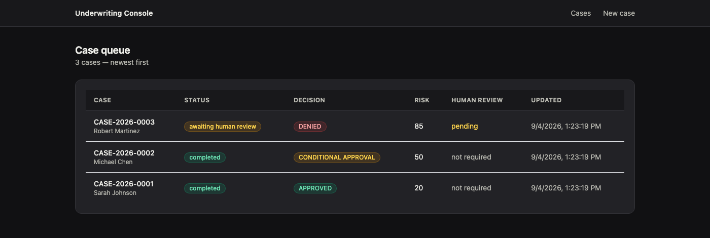
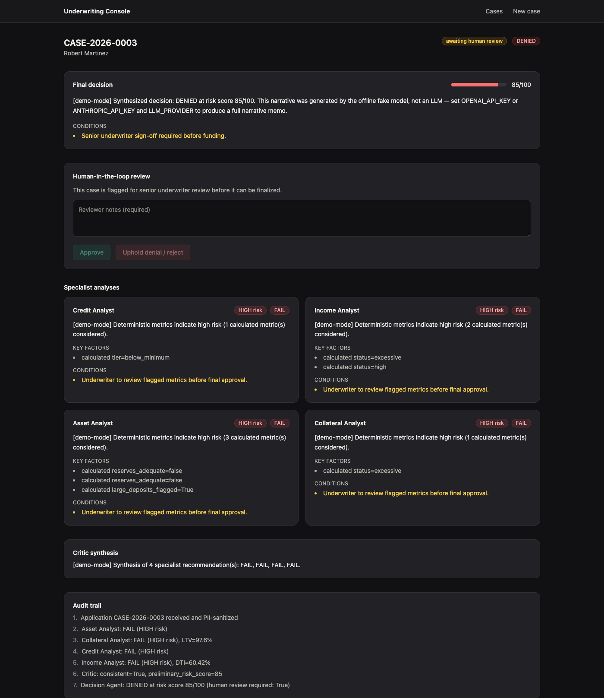

# Mortgage Underwriting System

[](https://github.com/Bogbra/mortgage-underwriting-system/actions/workflows/ci.yml)

A multi-agent mortgage underwriting engine: four specialist agents (credit,
income, asset, collateral) analyze an application in parallel, a critic
cross-checks their findings, and a decision agent produces an audit-ready
outcome — with deterministic guardrails (PII redaction, Fair Lending bias
scanning), a human-in-the-loop review gate, and a full audit trail.

It's built as a service: a LangGraph agent engine behind a FastAPI API,
persisted to Postgres/SQLite, with a Next.js reviewer dashboard on top.

<p align="center">
  <br>
  <sub>Case queue — status, decision, and risk score at a glance.</sub>
</p>

<p align="center">
  <br>
  <sub>Case detail — decision memo, human-in-the-loop review, every specialist's analysis, and a full audit trail.</sub>
</p>

## Why it's built this way

The short version — the full reasoning for each decision is in
[`docs/adr/`](docs/adr/):

- **[Structured outputs, not regex-parsed prose.](docs/adr/0001-structured-agent-outputs.md)**
  Every agent's response is a validated Pydantic model. Numbers that must be
  exact (DTI, LTV, reserves) are computed in plain Python and handed to the
  model as fact — never asked of it.
- **[Specialist agents run in parallel.](docs/adr/0002-parallel-specialist-execution.md)**
  Credit/income/asset/collateral don't depend on each other; they fan out
  from a single node and join at the critic, cutting that stage's latency
  roughly 4x versus polling them one at a time.
- **[The LLM provider is a config value, not a code path.](docs/adr/0003-provider-agnostic-llm-layer.md)**
  `LLM_PROVIDER=fake` (the default) runs the entire real workflow — parallel
  agents, RAG, guardrails — against a deterministic offline model. No API
  key is required to run this project or its test suite.
- **[PII redaction and bias detection are deterministic gates.](docs/adr/0004-deterministic-pii-and-bias-guardrails.md)**
  Neither depends on the model choosing to comply with an instruction.
- **[Persistence, audit trail, and auth are explicit, minimal, and swappable.](docs/adr/0005-persistence-audit-and-auth.md)**
  SQLite locally, Postgres in Docker, an append-only audit log, and a
  `Principal`-based auth seam sized for a portfolio project but shaped like
  the real thing.
- **[Down-payment adequacy is its own deterministic check.](docs/adr/0006-down-payment-adequacy-check.md)**
  Found by running the eval harness against a real model instead of only
  the offline fake — a case with more down payment required than liquid
  assets available had nothing computing that comparison at all.
- **[RAG is evaluated on retrieval, groundedness, judge reliability, and citation accuracy — four separate checks.](docs/adr/0007-rag-evaluation.md)**
  A decision-level eval can't see any of these. Retrieval recall@6 started
  at 43% (a chunking bug, since fixed — now 100%); groundedness sits at
  25% because an LLM-as-judge flags correct claims over wording, not
  numeric errors — a deterministic citation-accuracy check confirms zero
  actual LTV/DTI mistakes among what the judge rejected.
- **[The deterministic tools are also reachable over MCP.](docs/adr/0008-mcp-tool-exposure.md)**
  `mcp_server.py` wraps the identical `domain/calculations` functions the
  LangGraph agents call in-process — one calculation, two transports.

## Architecture

```
                    ┌─────────────────────────────┐
                    │      Next.js dashboard       │
                    │  (Server Components +        │
                    │   Server Actions; token       │
                    │   never reaches the browser)  │
                    └───────────────┬───────────────┘
                                    │ REST (bearer auth)
                    ┌───────────────▼───────────────┐
                    │           FastAPI              │
                    │  cases router · auth · rate    │
                    │  limiting · SQLAlchemy (Case,  │
                    │  audit_events)                 │
                    └───────────────┬───────────────┘
                                    │ BackgroundTasks
                    ┌───────────────▼───────────────┐
                    │        LangGraph workflow      │
                    │                                │
                    │   initialize (PII redaction)   │
                    │        │  │  │  │              │
                    │     credit income asset collat  │ ← parallel
                    │        │  │  │  │              │
                    │        └──┴──┴──┘              │
                    │            ▼                   │
                    │          critic                │
                    │            ▼                   │
                    │         decision                │
                    └───────────────┬───────────────┘
                                    │
                     ┌──────────────┼──────────────┐
                     ▼              ▼              ▼
              domain/calculations  rag/policy_store  domain/bias
              (deterministic)      (Chroma + RAG)    (hard gate)
```

## Repository layout

```
backend/            Python: domain logic, agents, graph, RAG, FastAPI service
  src/underwriting/
    domain/          Pure business logic: calculations, PII, bias, schemas
    llm/             Provider-agnostic client + offline fake model/embeddings
    rag/             Policy chunking, embedding, retrieval
    agents/          One module per agent (credit/income/asset/collateral/critic/decision)
    graph/           The LangGraph workflow definition
    api/             FastAPI app: routers, auth, persistence, rate limiting
    evals/           Decision-quality regression + RAG recall/groundedness/judge/citation evals
    mcp_server.py    Deterministic tools + policy retrieval, exposed over MCP
  data/              Policy manual (markdown), golden test cases, RAG eval queries
  tests/             pytest: unit (domain) + integration (graph, API)
apps/web/            Next.js 15 dashboard (case queue, detail, HITL review)
infra/               Dockerfiles + docker-compose (api, web, Postgres)
docs/adr/            Architecture decision records
```

## Running it

### Locally (fastest inner loop)

```bash
# Backend
cd backend
uv sync --extra dev
uv run uvicorn underwriting.api.main:app --reload --port 8000

# Frontend, in another terminal
cd apps/web
npm install
cp .env.local.example .env.local
npm run dev
```

Open `http://localhost:3000`, go to **New case**, load one of the three
sample applicants, and submit — no API key needed, `LLM_PROVIDER=fake` is
the default. Swap in a real key by copying `backend/.env.example` to
`backend/.env` and setting `LLM_PROVIDER=openai` + `OPENAI_API_KEY` (or the
Anthropic equivalents).

### Docker Compose (Postgres-backed)

```bash
docker compose -f infra/docker-compose.yml up --build
```

Dashboard at `http://localhost:3000`, API at `http://localhost:8000`.

## Testing and evals

```bash
cd backend
uv run pytest tests -q                        # 62 tests: domain unit tests +
                                               # full-graph integration tests +
                                               # API tests, all offline
uv run python -m underwriting.evals.run       # golden-case decision regression
uv run python -m underwriting.evals.rag_eval  # RAG: recall@k, groundedness, judge reliability, citation accuracy
uv run ruff check src tests                   # lint
```

`tests/integration/test_graph_fake_llm.py` runs the real parallel workflow
end-to-end, including a regression test that forces all four specialist
agents to raise a bias flag simultaneously and asserts all four survive the
concurrent state merge — the exact bug class a naive (overwrite, not
append) LangGraph reducer would introduce silently.

`evals/run.py` is the decision-quality gate: it runs the three golden cases
(a clean approval, a marginal case with several real flags, and a clear
denial) and diffs the actual decision against the expected one. Pass
`--provider openai` to run it against a live model before shipping a prompt
change.

`evals/rag_eval.py` evaluates the RAG layer specifically — decision-level
evals can't see any of this, across four phases. **Phase 1** measures
retrieval hit_rate@k *and* true recall@k (`|expected ∩ retrieved| /
|expected|`) against 14 golden `query → expected policy section(s)` pairs
(`data/evals/rag_golden_queries.json`). **Phase 2** checks whether each
specialist agent's actual output is *grounded* in the policy text it was
given, via an LLM-as-judge (or a word-overlap heuristic offline). **Phase
3** checks whether that judge itself is calibrated, against a small
hand-labeled set built from a known judge false positive. **Phase 4**
deterministically checks — no LLM involved — whether the specific LTV/DTI
percentages specialists cite match the policy manual's own numeric bands.
Run with `--provider openai --embeddings openai` for numbers that mean
something — the default fake embeddings/LLM are a content-blind hash and
an offline heuristic (see ADR 0003), so Phase 1 prints a warning rather
than let anyone mistake a fake-mode number for retrieval quality. CI runs
the whole thing offline as a smoke test (all four phases execute, no API
key needed); the real run is a manual/periodic check, not a CI gate, for
the same cost/determinism reasons `evals/run.py --provider openai` is.
The honest result on this project's own policy document and golden
cases — retrieval fixed from 43% to 100% after a chunking bug, but
groundedness at 25% because the judge is strict about wording rather than
finding actual numeric errors (citation accuracy finds zero) — plus what
each finding points at, is written up in
[ADR 0007](docs/adr/0007-rag-evaluation.md).

## MCP server

The deterministic calculators and policy retrieval are also reachable over
[MCP](https://modelcontextprotocol.io) — the identical `domain/calculations`
functions the LangGraph agents call in-process, not a reimplementation (see
[ADR 0008](docs/adr/0008-mcp-tool-exposure.md)).

```bash
cd backend
uv sync --extra mcp
uv run python -m underwriting.mcp_server
```

To connect it to Claude Desktop (or any MCP client that launches a local
stdio server), add to its config:

```json
{
  "mcpServers": {
    "underwriting-tools": {
      "command": "uv",
      "args": ["run", "--project", "/absolute/path/to/backend", "python", "-m", "underwriting.mcp_server"]
    }
  }
}
```

Nine tools: `calculate_dti_ratio`, `calculate_ltv_ratio`,
`calculate_down_payment_adequacy`, `calculate_reserves`,
`calculate_housing_expense_ratio`, `check_credit_score_policy`,
`find_large_deposits`, `calculate_total_debt_obligations`, and
`retrieve_underwriting_policy`.

## Security posture (and its limits)

- PII is redacted once, at the workflow boundary, before any LLM call —
  never re-derived downstream.
- Fair Lending (ECOA) compliance has a deterministic regex/substring gate
  that runs on every specialist output unconditionally, plus an LLM-based
  critic review as a second layer for subtler issues.
- Auth is bearer-token based with a `caller` / `reviewer` role split; the
  frontend keeps both tokens server-side and never ships them to the
  browser.
- A simple in-process rate limiter sits in front of the API.
- What's explicitly **not** production-hardened, and documented as such in
  [ADR 0005](docs/adr/0005-persistence-audit-and-auth.md): the auth tokens
  are a placeholder for a real IdP, there's no encryption-at-rest, and the
  rate limiter doesn't survive multiple instances.
